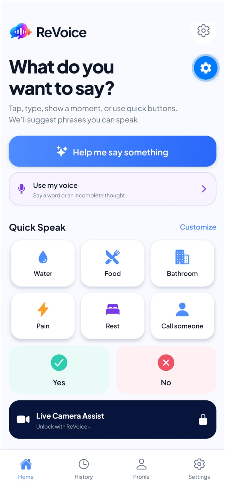

# ReVoice

**Turn intent into voice.**

ReVoice is an assistive communication app for people who know what they want to say but may have difficulty turning that intention into words.

**Human intent → AI assistance → human choice → voice**



## Features

- Quick Speak essentials that remain available without AI
- Customizable and reorderable phrase cards
- Intent Builder with exactly three possible interpretations
- Human confirmation before a phrase is spoken
- Device text-to-speech with slower, repeat, favorite, and stop controls
- Voice Intent with speech recognition and personal vocabulary context
- Live Camera Assist with front and rear camera support
- Live captions in Camera Assist
- Local care profile, history, favorites, and appearance settings
- ReVoice+ purchases and entitlement management through RevenueCat

## Architecture

The Expo mobile app calls two focused Vercel endpoints: `POST /api/intent` and `POST /api/visual-intent`. Only the backend communicates with OpenAI, so the OpenAI API key is never embedded in the app. Text-to-speech runs on the device. RevenueCat communicates directly through its React Native SDK.

ReVoice+ access is determined exclusively by the active RevenueCat entitlement named `pro`. Quick Speak, Yes/No, basic phrases, and basic text-to-speech remain free.

## Run locally

Requirements:

- Node.js and npm
- An Android device
- A ReVoice EAS Development Build for native camera, speech recognition, and RevenueCat testing

Install and start the project:

```bash
npm install --legacy-peer-deps
npx expo start --dev-client
```

Copy `.env.example` to `.env.local` and configure the public mobile values. Configure `OPENAI_API_KEY` only in the Vercel project environment.

## Environment variables

- `EXPO_PUBLIC_API_BASE_URL`: public URL of the deployed backend
- `EXPO_PUBLIC_REVENUECAT_API_KEY`: RevenueCat public SDK key used by the mobile app
- `OPENAI_API_KEY`: backend-only secret configured in Vercel; never use an `EXPO_PUBLIC_` prefix

## Android Development Build

```bash
npx eas-cli@latest login
npx eas-cli@latest build:configure
npx eas-cli@latest build --profile development --platform android
```

Install the resulting APK and connect it to Metro with:

```bash
npx expo start --dev-client --clear
```

The RevenueCat Test Store key is intended only for debuggable development builds. A production release must use the appropriate platform-specific RevenueCat public SDK key.

## Safety and privacy

ReVoice is an assistive communication tool. It does not diagnose, treat, or provide medical advice and is not a substitute for professional care or emergency services. See [PRIVACY.md](./PRIVACY.md).

## Shipaton

Created by Gustavo de Carvalho Cypriano, University of São Paulo (USP), for RevenueCat Shipaton 2026 — Next Gen.

Submission-ready assets and copy are available in [`submission/`](./submission) and [`SUBMISSION.md`](./SUBMISSION.md).

## License

[MIT](./LICENSE)
